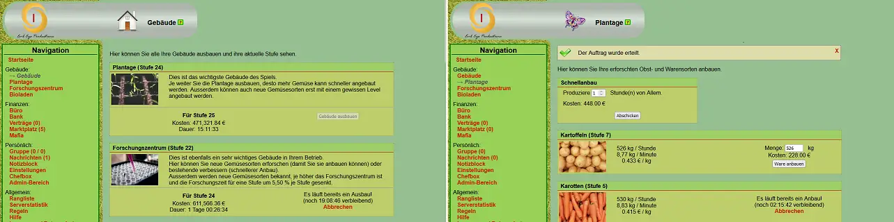
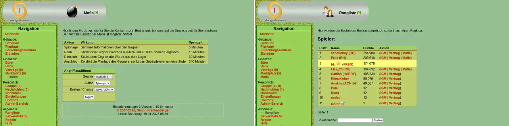

# Der Bioladenmanager 2 (BLM 2)

> Ein einfaches, klassisches Open Source Aufbaustrategie Spiel

Der Bioladenmanager ist ein klassisches Echtzeit-Aufbaustrategie Spiel.
Pflanze auf deiner Plantage 15 verschiedene Obst- und Gemüsesorten an, erfosche im Forschungszentrum neue Pflanzen und
verbessere die bereits bekannten.
Im Bioladen kannst du die Waren an virtuelle Kunden verkaufen und per Marktplatz auch an andere Spieler.
Mit der Mafia kannst du deine Gegenspieler ausrauben und ihre Plantagen attackieren um dir so einen Vorteil im harten
Wettbewerb zu erkämpfen.
Organisiere dich mit anderen Spielern in Gruppen, schliesse Bündnisse oder führe Krieg.

Das komplette Spiel ist kostenlos, werbefrei, OpenSource und auf Geschwindigkeit optimiert.
Selbst mit einer Edge-Mobilfunkverbindung ist das Spiel noch sehr gut spielbar.




## Installation

### 0) Voraussetzungen

- Apache 2.4+ (für `.htaccess` Zugriffsbeschränkungen)
  - mod_alias
  - (empfohlen) mod_headers
  - (empfohlen) mod_brotli und mod_setenvif
- PHP 7.4+
  - gd (mit WebP-Unterstützung)
  - mcrypt
  - pdo_mysql
  - zip
- MariaDB 10.2+ (oder MySQL 8.0+)

Die automatischen Tests laufen mit:

- Apache `2.4.56`
- PHP `7.4.33`
- MariaDB `10.2.44`.

Auf dem [Livesystem](https://blm2.fraho.eu) läuft die Anwendung (Stand Jannuar 2023) mit:

- Apache `2.4`
- PHP `8.1`
- MariaDB `10.6`

### 1) Dateien entpacken / hochladen

Das Projekt kann entweder direkt als git-Repository oder entpackt aus einem Zip-Archiv installiert werden.
Hierzu einfach alle Dateien des Projekts auf dem Webspace laden.

### 2) Konfiguration erstellen

Anschliessend muss noch eine minimale Konfiguration erstellt und als `config/config.ini` gespeichert werden:

```ini
[base]

; a random secret which is used to initialize the random number generators
; for the deterministic interest and item selling rates
random_secret = "!!replace this!!"

; a random secret which is used to initialize the random number generators
upgrade_secret = "!!replace this!!"

; base url for this game (needed for absolute urls like in mails)
base_url = "https://blm2.example.com"

; operator name
admin_name = "Insert Name Here"

; operator email address
admin_email = "contact-address@example.com"

; address line 1 (for impressum, optional)
admin_addr_line_1 = "Street Name, may be empty"

; address line 2 (for impressum, optional)
admin_addr_line_2 = "Zip-Code and Country, may be empty"

[database]
; hostname to connect to
hostname = "localhost"
; database name to connect to
database = "blm2"
; username for connection
username = "blm2"
; password for connection
password = "blm2"
```

Die als `!!replace this!!` markierten Felder müssen mit zufälligen Werten gefüllt werden.
Dies dient der Fairness und Sicherheit des Spiels und sorgt dafür, dass die zufällig generierten Werte (unter Anderem
die Warenkurse des Bioladens und die Zinsraten der Bank) nicht im voraus berechnet werden können.
Hierzu kann der Generator von
[dieser Seite](https://www.random.org/strings/?num=5&len=20&digits=on&upperalpha=on&loweralpha=on&unique=on&format=html&rnd=new)
verwendet werden.

Eine Liste der verfügbaren Parameter kann der [Standardkonfiguration](config/config-defaults.ini) entnommen werden.
Nicht explizit gesetzte Optionen werden von dieser Datei übernommen.

**Wichtig:** Die Standardkonfiguration sollte nicht geändert werden, da diese mit jedem Release neu ausgeliefert wird.
Stattdessen sollten alle von der Standardkonfiguration abweichenden Einstellungen in der `config.ini` gesetzt werden.

### 3) Installationsprozess starten

Nachdem die Konfiguration angelegt wurde, kann die Installation der Datenbank beginnen.
Hierzu muss die `install/update.php?secret=__upgrade_secret__` aufgerufen werden.
Der Parameter `secret` muss in der Anfrage durch das konfigurierte `upgrade_secret` ersetzt werden.

Die Installation läuft automtisch ab und kann einige Sekunden dauern.
Währenddessen lädt die Seite und es wird erst nach Abschluss der Installation der Status ausgegeben.

```text
[OK]: Checking installation for version 1.11.0:
[OK]: Verifying upgrade credentials
[OK]: Verifying secrets changed
[OK]: Verifying database connection
[NEEDS UPGRADE]: Checking base installation
[OK]: Executing basic setup script
[NEEDS UPGRADE]: Checking for update information
[OK]: Creating initial update information
[OK]: Enumerating update scripts (Found 11 scripts)
[OK]: Checking sql/00-1.10.0-setup.sql (skipped)
[OK]: Checking sql/01-1.10.1-update_info.sql (skipped)
[OK]: Executing new sql/10-1.10.2-groups-created.sql
[OK]: Executing new sql/11-1.10.3-log_marktplatz.sql
[OK]: Executing new sql/12-1.10.3-log_nachrichten.sql
[OK]: Executing new sql/13-1.10.3-fix_points.sql
[OK]: Executing new sql/14-1.10.3-drop_statistik-ProduktionPlus.sql
[OK]: Executing new sql/15-1.10.4-drop_auftrag-points.sql
[OK]: Executing new sql/16-1.10.6-log_login-add-anonymized.sql
[OK]: Executing new sql/17-1.10.7-nachrichten-delete-self-messages.sql
[OK]: Executing new sql/18-1.10.10-runtime_config.sql
[OK]: Saving update information
[NEEDS UPGRADE]: Verifying existing accounts (No accounts found)
[OK]: Create new admin account (New user 'admin' with password 'gCcKhP0KiSwjtXlS')
[OK]: Checking for runtime configuration
[NEEDS UPGRADE]: Verifying last cronjob run timestamp (Entry not found)
[OK]: Create lastcron entry
[NEEDS UPGRADE]: Verifying last points calculation timestamp (Entry not found)
[OK]: Create lastpoints entry
[NEEDS UPGRADE]: Verifying currently active round (No active round found)
[OK]: Starting new round

Update finished successfully!
Execution took 1,215.51 ms
102 queries were executed
```

Die initiale Installtion erstellt auch einen Admin-Benutzer (`admin`) mit einem zufällig generiertem Passwort.
Das Passwort wird in der Ausgabe angezeigt und ist in dem obigen Beispiel `gCcKhP0KiSwjtXlS`.

### 4) Cronjob einrichten

Das Spiel benötigt einen Cronjob, welcher periodisch läuft. Dies dient dazu, die Zinsen, das Basiseinkommen und diverse
weitere Funktionen durchzuführen.

Das Intervall des Cronjobs ist standardmässig 30 Minuten, ein Cronjob auf Systemebene könnte somit wie folgt aussehen:

```text
# min   hour    day     month   weekday  command
*/30    *       *       *       *        /usr/bin/php /var/www/htdocs/cronjobs/cron.php
```

### Spiel aktualisieren

Nach der Installation einer neuen Version sollte das `update.php` nochmals aufgerufen werden.
Dies sorgt dafür, dass etwaige Datenbankänderungen nachinstalliert werden.

Anpassungen an der `config.ini` werden hingegen **nicht** automatisch durchgeführt, diese müssen manuell eingetragen
werden.
Welche Parameter sich zwischen den Versionen geändert haben können dem [CHANGELOG.md](CHANGELOG.md) entnommen werden.

## Entwicklung

### Voraussetzungen

- Git
- Docker mit docker-compose
- [Java 17+](https://adoptium.net/temurin/releases/) (für Tests und closure-compiler)
    - [closure-compiler.jar](https://search.maven.org/artifact/com.google.javascript/closure-compiler) (Minify
      Javascript)
- [NodeJS LTS 18+](https://nodejs.org/en/) (für csso-cli)
    - [csso-cli](https://www.npmjs.com/package/csso-cli) (Minify CSS Stylesheets)

### Minify Javascript

Die Javascript Dateien werden mittels des closure-compilers optimiert und minimiert.
Das sorgt dafür, dass die eingebundenen Javascript Bibliotheken schneller geladen werden.

Linux / MacOs:

```shell
java -jar ~/bin/closure-compiler-v20230103.jar --compilation_level SIMPLE_OPTIMIZATIONS --js js/functions.js
```

Windows:

```shell
java -jar %HOME%\bin\closure-compiler-v20230103.jar --compilation_level SIMPLE_OPTIMIZATIONS --js js\functions.js
```

### Minify CSS

Die CSS Dateien werden mittels csso optimiert und minimiert.
Das sorgt dafür, dass die eingebundenen CSS Stylesheets schneller geladen werden.
Da csso-cli nur als Linux Shell-Script vorliegt, kann dieses unter Windows nur über die Git-Bash (oder WSL) ausgeführt
werden.

Initial muss `csso-cli` via `npm` installiert werden:
```npm install -g csso-cli```

Anschlissend können alle Styles mit folgendem Script minimiert werden:

```shell
#!/bin/sh
export NODE_HOME=~/devel/node-v18.13.0-linux-x64
export PATH=$NODE_HOME:$PATH

for file in $( find styles -name \*.css -and -not -name \*.min.\* ); do
  $NODE_HOME/node_modules/csso-cli/bin/csso \
    -i $file -o ${file%%.*}.min.css --no-restructure --stat
done
```

### IDE (PhpStorm)

Die primäre Entwicklung wird mit der IDE [PhpStorm](https://www.jetbrains.com/phpstorm/) durchgeführt.
Um die CSS und Javascript Dateien automatisch mit dem Minify zu konvertieren können "Watcher" auf den Dateien angelegt
werden.

Im [watchers.xml](development/watchers.xml) liegen die Watchers als Beispielkonfiguration.
Diese können in den Einstellungen unter `File / Settings / Tools > File Watchers` importiert werden.

### Tests

Das Spiel wird mit jeder Änderung durch automatisierte Tests überpüft.
Hierzu wird ein Java-Projekt mit JUnit und Selenium im `tests/` Ordner verwendet.
Die Tests benötigen eine spezielle Konfiguration des Spiels.
Hierzu muss der [docker-compose stack](tests/src/test/resources/docker-compose.yaml) aus dem `src/test/resources` Ordner
gestartet sein. Anschlissend können die Tests aus der IDE oder mittels `./gradlew test` ausgeführt werden.
